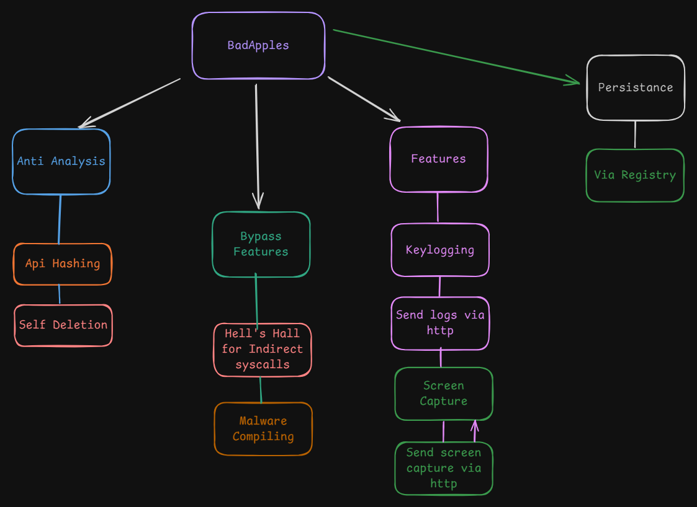

# BadApples RoadMap

# In the works...
 - [ ] **(anti debugging)** self deletion.
 - [ ] **(spying)** Impliment keylogging system using `NTAPI` functions.
 - [ ] **(runtime)** CRT removal.
 - [ ] **(anti analysis)** Api hashing.

# 16/03/2025
 - [x] Achieved sending the screenshot to remote server via HTTP with wininet functions.

# 15/03/2025 Update
 - [x] **(uninstall)** Use NtQuerySystemInformation to check if the payload proc is running. If so, terminate before delete from disk, otherwise deletion won't work.

# Recent update
 - [x] `GoodApple` which is an uninstaller and will gracefully remove the persistance and payload.
 - [x] Read the payload file and wrote it to temp directory.
 - [x] Added execution of the payload after persistance achieved. I think that the execution method needs work.
 - [x] Changed the sysbsystem of the Payload so that no window pops up. (Had to use `CopyMemoryEx` maybe look at creating a helpers.h file)
 - [x] **(spying)** Customizable cooldown inbetween screenshots.
 