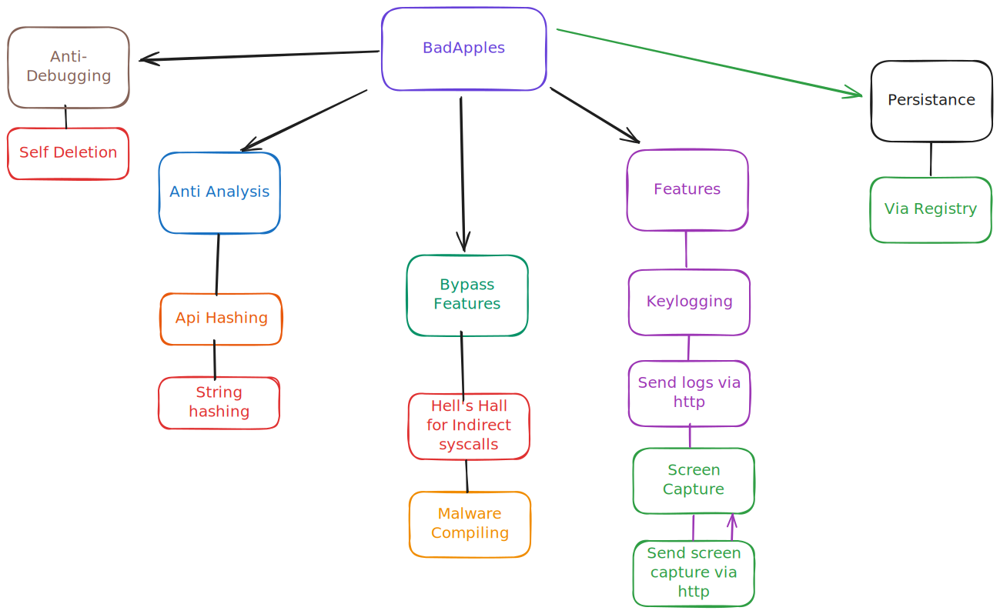

# BadApples RoadMap

# Description
**BadApples** Is a `Spyware` like program that will capture screenshots of the users desktop and send the screenshot to a remote server. The screenshot that is taken is not stored on disk on the victims computer It's bytes are sent to a remote server straight away, and the remote server needs to then write those bytes to a .bmp file on disk. This project will implement more features in the future.

I also wanted to play with some persistence techniques since I hadn't really messed around with them yet. I found this [Windows Persistance Map 1.0](https://how2itsec.blogspot.com/)where I then found the registry key that I use for this projects persistence. Nothing special but works fine.

The project is not complete yet. The end goal is to implement a keylogging feature as well, and possibly more features later on.

# Current features
  - Capture desktop snapshot and send to remote server via `Wininet`.
  - Exploit registry keys for persistence of the spyware.
  - `GoodApples` Successfully uninstalls the spyware from the system.
# In the works...
 - [ ] **(anti debugging)** self deletion.
 - [ ] **(spying)** Implement keylogging system using `NTAPI` functions.
 - [ ] **(runtime)** CRT removal.
 - [ ] **(anti analysis)** Api hashing.